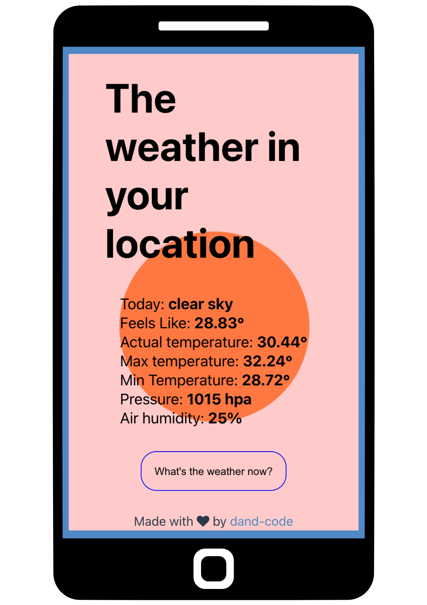

# Weather App ☀️ ⛈️ ❄️


There's no secret: this application intends to show the weather forecast in real-time.

Working on this project, I would like to try using the **Axios** library to make requests to an API and access the **user's location**, besides being able to work with **web push notifications**.

Excited to see the results :)



<!-- > Note: I was so excited to experiment the new skills that I forgot to use differents branches to versions control. I expect to take care more about it right now. \O/  -->

###### OK, let's talk about what I have learned (up to now)...

### User Geolocalization
The first step to building this application was to be able to access the user's geolocation. For this, I used the web API **geolocation**, which with the `getCurrentPosition` function, allows me to access this information.


```javascript
useEffect(() => {
    const geo = navigator.geolocation;
    geo.getCurrentPosition((position) => {
      getWeather(position.coords.latitude, position.coords.longitude);
      setLocation(true);
    })
  }, []);
```

I use `useEffect` because I want this information to be fetched only once: when loading the page.

### Axios to get API data

Once I have the user's geolocation information, I can now complete the API request with the latitude and longitude coordinates needed to complete the request URL.

```javascript
let getWeather = async (lat, long) => {
    let res = await axios.get("http://api.openweathermap.org/data/2.5/weather", {
      params: {
        lat: lat,
        lon: long,
        appid: process.env.REACT_APP_OPEN_WHEATHER_KEY,
        lang: 'en',
        units: 'metric'
      }
    });
    setWeather(res.data);
};
```
It seemed easier for me to request an API with the Axios library because it was not necessary to convert the response to JSON format. Furthermore, handling errors with Axios is also simpler.

### Responsive design without media queries

I was eager to try this way to mock up a responsive web page without any media querie. The secret is in the use of some CSS Grid properties.

With three code lines it was possible to do this magic:

```css
.main{
    display: grid;
    gap:1rem;
    grid-template-columns: repeat(auto-fill,minmax(15rem, 1fr));
}
```

## Next steps

#### Web push notification

Work in progress...
